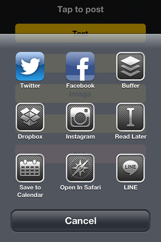

UIActivityCollection
====================

A collection of UIActivity providers.



##Usege

```
$ git clone git://github.com/shu223/UIActivityCollection.git
$ cd UIActivityCollection/
$ git submodule update --init --recursive
```

Please check out the demo!